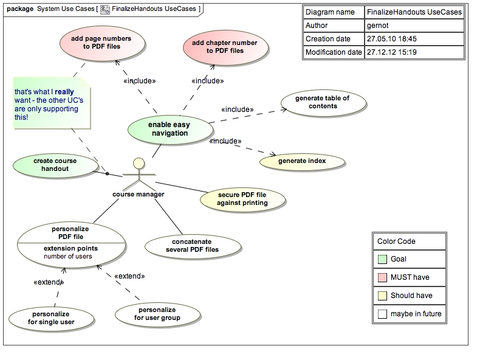
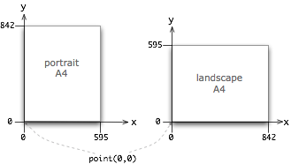

# Documentation for the arc42 pdf page numberizer

##### Contents

1. [Intro and Requirements](#header_intro)         
2. [Constraints](#header_constraints)            
3. [Context](#header_context)
4. [Solution Strategy](#header_solution) 
5. [Building Blocks](#header_blocks)
6. [Crosscutting Concepts](#header_concepts)
    * Pdf handling (page layout, stamping, positioning text)
    * Domain model
    * Acceptance Testing (_behavior) 
    * Build 
7. [Developer Guide](#header_developer)
	* Directory layout 	

## [Intro and Requirements](id:header_intro)
We create PDF files from various sources (ppt, odt, doc, keynote, html...) and want to create nice printable handouts from these sources.

With these various document sources, it's neither possible to create consistent pagenumbers, nor to add custom header information.

Instead of flushing down many many bucks into A****s hungry mouth I decided to create this solution on my own.

### Use Cases

Ooops - the following use case diagram looks like a big app - which our little pdf stamper is not :-)

Brief description of these use cases:

##### Add page (and chapter) numbers to Pdf files
* number the pages consecutively, remember the last pagenumber from the previous file to calculate the first pagenumber of the current file.
* *evenify* on demand: add a blank page at the end of every file that has an odd number of pages. Reason: Odd numbers shall always be printed on *right* pages, even numbers are always an *left* pages. On double-sided books, even numbers are always on backsides… Without *evenification*, some chapters could start with an even pagenumber.
* Optionally add the number of the current file in the footer.

 
##### Add header to Pdf files
Same as adding page- and chapter numbers - but stamping a (constant) text in the header.

##### Generate index
In handouts with more than 100 pages, it get's difficult to find particular topics without an index. We want to support

##### Create course handouts
* optional: combine several pdf files into ONE.
* optional: add security, so people cannot (1) open, (2) print or (3) copy from the file. The Pdf file format and most Pdf readers support these security restrictions. Security is based upon passwords.
* optional: add logo and/or watermarks.
* 

### Architecture and Quality Goals

Priority | Quality Goal | Descriptive Scenarios
:-------: | :----------- | :--------------------
      1  | Low Cost      | no license fees
         |               |  
      2  | Reliability   | must never corrupt a pdf file
         |               | even in case of power loss,           original files are preserved and unmodified.
         |               |
      3  | Understandability | systems shall serve as docu,
         |               |  implementation and testing example. 

---
## [Contraints](id:header_constraints)

Due to limited time and resources, we impose some limitations to our development effort:

* We currently expect paper to be A4 size, usually in portrait orientation.

* We don't
    * manipulate secured PDF's (files that require passwords to read or print their contents)
    * provide a graphical user interface (yet)
        handle corrupt PDF files
        
        
* We only:
    * guarantee results only for some well-known paper sizes
    * handle a few hundred pages per file, as all operations is currently performed in-memory

---
## [Context](id:header_context)

TODO

---
## [Solution Strategy](id:header_solution)
* Use the [iText Pdf][url_itext] library, as it is open source and easy to use
* Apply ATDD (acceptance test driven development) with [Spockframework][url_spock]
* Develop the application in releases of increasing complexity:
	1. First release can be used from an IDE only, no packaging
	2. Second release is usable from the command line
	3. Third release is built and packaged with gradle 
	
	
---
## [Building Blocks](id:header_blocks)

TODO

---
## [Crosscutting Concepts](id:header_concepts)

### Pdf page layout and dimensions

### Determine position of page number and header
Currently we want page numbers in the bottom, either 
* centered (for both even and odd numbered pages)
* at the outside (that means _right_ for odd pages, _left_ for even ones.) 

We need to calculate this position for every page, as pagesize or orientation might vary within PDF documents.

### Well known page sizes
Our most important page sizes are already predefined in iText in [the itextpdf.text.PageSize][url_itext_pagesizes] class (based upon itextpdf.text.Rectangle).

An example: determine the pagesize of A4 pages:

    import com.itextpdf.text.PageSize
    assert 595 == PageSize.A4.width
    assert 842 == PageSize.A4.height
    

### Determine size of page in pdf file

Calculating the size of a page we use an instance of iText.PdfReader as follows:
    
    import com.itextpdf.text.Rectangle

    private Point calculatePageNrPosition( int currentPageNumberInFile ) 
    {
        Rectangle rectangle = 
             reader.getPageSize(bcurrentPageNumberInFile );
        int width = rectangle.getRight()
        
        int heigth = rectangle.getTop()

### Adding text to existing pdf files (aka stamping)

### Building the application

### Acceptance Testing
The app was developed in _acceptance test driven development_ (ATDD) style: Before I wrote productive code, I formulated the appropriate acceptance test as [Spock Specification][url_spock].

#### Preconditions for Testing
(aka infrastructure for testing)

A number of sample pdf files have to exist at specific locations. These are defined in the TestResources class:

    final static TEST_RESOURCES_DIR = "./test/resources/"
    final static EMPTY_DIR          = TEST_RESOURCES_DIR + "EmptyDir/"
    final static DIR_WITH_ONE_PDF   = TEST_RESOURCES_DIR + "OnePdf/"
    final static DIR_WITH_HUGE_PDF  = TEST_RESOURCES_DIR + "colored_XL_Pdf/"
    final static DIR_WITH_TWO_PDFs  = TEST_RESOURCES_DIR + "TwoPdfs/"
    final static DIR_WITH_MANY_PDFs = TEST_RESOURCES_DIR + "ManyPdfs/"

#### Major Test Case: Stamping the Correct Number of Pages
<tbd>

 
---
## [Developer Guide](id:header_developer)

---
[url_itext]: http://itextpdf.com "iText Pdf Library"
[url_spock]: http://www.spockframework.org "Spock Acceptance Test Framework"
[url_itext_pagesizes]: http://api.itextpdf.com/itext/com/itextpdf/text/PageSize.html