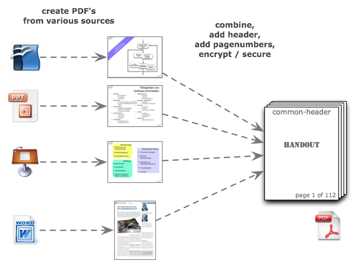

## What PdfStamper does for you

* add page numbers to a number of pdf files within (source) directory
* it numbers consecutively, starting with page 1

* PdfStamper NEVER modifies the source pdf's - it will ALWAYS copy them (page-by-page) to a target directory and add content only on the newly created copies.

* On the UI, you can configure a file-prefix and page-number-prefix. 

## Prerequisites

* all pdf files are located within (current or configured) directory

* all pdf files (should currently) have A4 size and portrait orientation
* page bottom has enough free space to add pagenumber and prefix

## Future Plans

* create an index: collect keywords from the pdf files, sort them and create a nicely formated index.

* stamp a header (in addition to the current footer)
* make the positions for page numbers configurable
* stamp pdf files of arbitrary page dimensions
* calculate the page number position on per-page-basis, instead of having a fix one
* preview generated files

 

 
 

